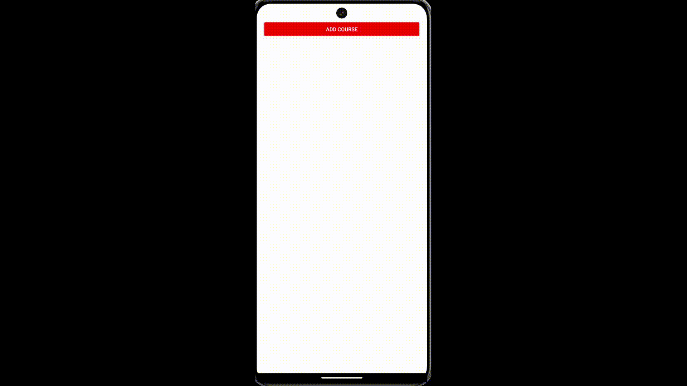

<h1>🚀 Excited to share my latest project: My Courses app, built with React Native!<h1/>

🎓 Key Features:

->>React Modal Integration: Seamlessly add and manage course names using modals. 
->>Dynamic TextInput: Enter your course names and see them instantly displayed on the main screen. 
->>Smooth Transitions: Utilize prop transitions to open and close modals effortlessly. 
->>Course Display: View all your added courses in a clean, user-friendly interface. 
->>Building this app was a great learning experience in handling React Modals and prop transitions. Check out the screenshots and stay tuned for more updates! 🚀📱 

